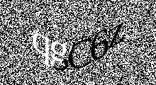

# captcha-generator

Generate large amounts of captchas (in parallel) with a simple binary written in Rust.

## Usage

Download the binary from the recent release.

Then:
```bash
captcha-generator [number-of-captchas] [path/to/output/dir]
```

The text of the captcha will be stored in the filename.

## Examples
1. Generate 100 random captchas to a `data` directory inside your current working directory.

  ```bash
  captcha-generator 100 ./data
  ```


2. Generate 1 random captcha to a './data/train' directory inside your current working directory.
  ```bash
  captcha-generator 1 ./data/train
  ```
  produces `./data/train/qgC6z.png`

  
